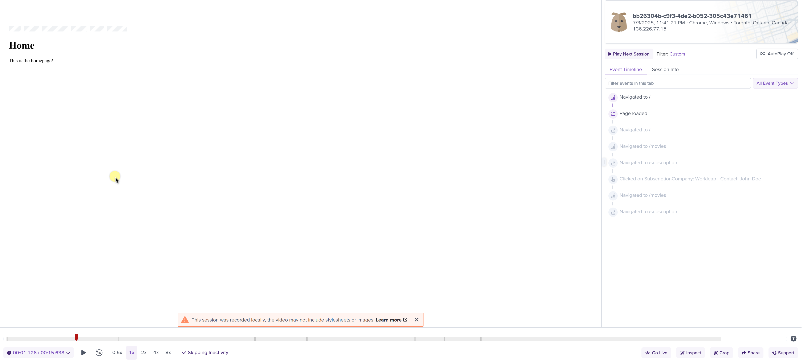
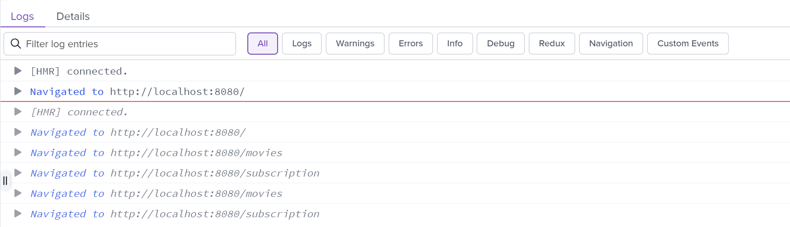
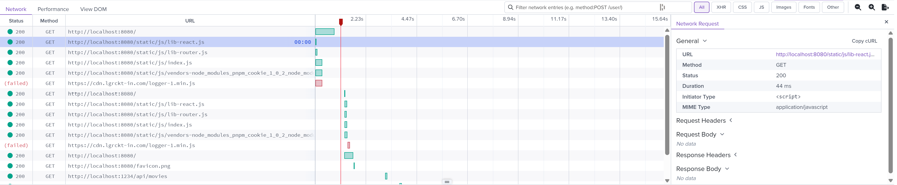
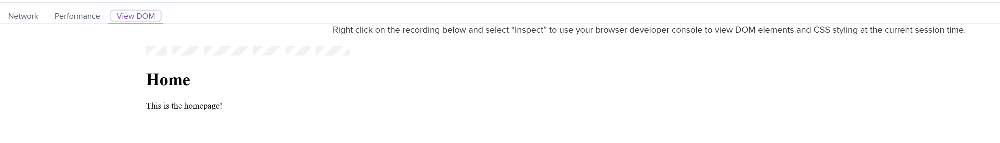

# Getting started

To gain full visibility into **frontend behavior** in **production**, Workleap has adopted [LogRocket](https://logrocket.com/), a tool that combines session replay, performance tracking, and error logging to help **understand** and resolve **issues** in **production**.

This package provides default LogRocket instrumentation tailored to Workleap's web applications needs, including the **removal** of **sensitive information** from HTML documents, HTTP requests/responses and URLs.

## Install the packages

First, open a terminal at the root of the application and install the following packages:

```bash
pnpm add @workleap/telemetry @workleap/logrocket logrocket
```

## Register instrumentation

Then, register LogRocket instrumentation using the [registerLogRocketInstrumentation](./reference/registerLogRocketInstrumentation.md) function:

```tsx !#6-8 index.tsx
import { registerLogRocketInstrumentation } from "@workleap/logrocket";
import { StrictMode } from "react";
import { createRoot } from "react-dom/client";
import { App } from "./App.tsx";

registerLogRocketInstrumentation("my-app-id", {
    verbose: true
});

const root = createRoot(document.getElementById("root")!);

root.render(
    <StrictMode>
        <App />
    </StrictMode>
);
```

!!!tip
It's recommend to log as much relevant information as possible to the console, since LogRocket includes console output in its session replays.
!!!

### Session replays

With instrumentation in place, [session replays](https://docs.logrocket.com/docs/session-replay) are now available in LogRocket:

:::align-image-left

:::

Session replays offer a wide range of features to help debug production issues, including the following :point_down:

#### Playback

:::align-image-left

:::

#### Console logs

:::align-image-left

:::

#### Network requests

:::align-image-left

:::

#### DOM interactions

:::align-image-left

:::

## Record elements

By default, this instrumentation sanitizes all user-provided text inputs and content. This includes:

- Form fields (like `<input>`, `<textarea>`)
- Text content inside HTML elements
- Dynamic DOM mutations containing text

Use `data-public` to explicitly allow LogRocket to record the content of an element. When this attribute is present, the content inside the element (including child elements) will be captured in the session replay:

```html
<div data-public>
    This text will be visible in the session replay.
</div>
```

!!!tip
To learn more about the built-in privacy settings of this instrumentation, refer to the [Privacy](./privacy.md) page.
!!!

## Identify a user

Most applications need to identify the current user environment. To help with that, `@workleap/logrocket` exposes the [createDefaultUserTraits](./reference/createDefaultUserTraits.md) function. When used with [LogRocket.identify](https://docs.logrocket.com/reference/identify), it provides all the tools to identify a  user with the key information that we track at Workleap.

Update your application bootstrapping code to include the `createDefaultUserTraits` and `LogRocket.identify` functions:

```tsx index.tsx
import { registerLogRocketInstrumentation } from "@workleap/logrocket";
import { StrictMode } from "react";
import { createRoot } from "react-dom/client";
import { App } from "./App.tsx";

registerLogRocketInstrumentation("my-app-id", telemetryContext);

const root = createRoot(document.getElementById("root")!);

root.render(
    <StrictMode>
        <App />
    </StrictMode>
);
```

```ts !#5-12
import { createDefaultUserTraits } from "@workleap/logrocket";
import LogRocket from "logrocket";

// Once a user is authenticated.
LogRocket.identify("6a5e6b06-0cac-44ee-8d2b-00b9419e7da9", createDefaultUserTraits({
    userId: "6a5e6b06-0cac-44ee-8d2b-00b9419e7da9",
    organizationId: "e6bb30f8-0a00-4928-8943-1630895a3f14",
    organizationName: "Acme",
    isMigratedToWorkleap: true,
    isOrganizationCreator: false,
    isAdmin: false
}));
```

## Try it :rocket:

Start the application in a development environment using the dev script. Render a page, then navigate to your [LogRocket](https://app.logrocket.com/) instance. Go to "Session Replay" page, you should see a new session appear.

You can try filtering the session list using different user traits, such as:

- `User Id`
- `Organization Id`
- `Is Admin`

### Troubleshoot issues

If you are experiencing issues with this guide:

- Set the [verbose](./reference/registerLogRocketInstrumentation.md#verbose) predefined option to `true`.
- Refer to the sample on [GitHub](TBD).

## Filter by correlation ids

The `registerLogRocketInstrumentation` function automatically adds two user traits to every session replay to **unify** LogRocket with the **other telemetry platforms**:

- `Telemetry Id`: Identifies a single application load. It's primarily used to correlate with Honeycomb traces.
- `Device Id`: Identifies the user's device across sessions. This value is extracted from the shared `wl-identity` cookie, which is used across Workleap's marketing sites and web applications.

To correlate a session with other telemetry platforms, filter the session list using these user traits.

## Migrate to v1.0

To migrate from the `@workleap-tracking/logrocket` package, follow the [migration guide](./updating/migrate-to-v1.0.md).
